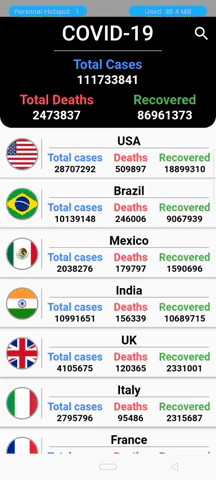

# covid_19_stats

A COVID-19 cases tracker application.

## Getting Started

This project is a Flutter application that shows live stats of COVID-19.

A few resources to get you started with a Flutter project:

- [Lab: Write your first Flutter app](https://flutter.dev/docs/get-started/codelab)
- [Cookbook: Useful Flutter samples](https://flutter.dev/docs/cookbook)

For help getting started with Flutter, view our
[online documentation](https://flutter.dev/docs), which offers tutorials,
samples, guidance on mobile development, and a full API reference.

 
